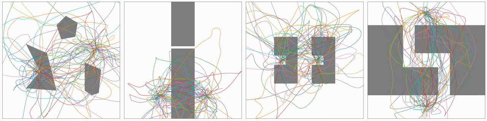

## Via-Point based Stochastic Trajectory Optimization

This repository contains python code for hands-on numerical, gradient-free, time-optimal trajectory optimization. It implements the [VP-STO](https://sites.google.com/oxfordrobotics.institute/vp-sto) stochastic trajectory optimizer. The code is intended for offline planning purposes.

Features:
- Implement your objective as a function of positions, velocities, accelerations and total duration of the trajectory, **no gradient** needed.
- Define **initial position, initial velocity and final velocity**, the solution is internally constrained to those (no extra cost term needed).
- Define **velocity and acceleration limits**, the solution is internally constrained to those (no extra cost term needed).
- Increase chances to **avoid local minima** through the exploration characteristics of VP-STO due to CMA-ES as underlying optimization technique.
- **Choose to constrain** the final position, e.g. the target is known but the trajectory connecting initial and final position should be collision-free (no extra cost term needed). Keep it subject to optimization if final position is implicitely described by the cost function (e.g. joint-space planning with task-space target).
- Use a low resolution for fast optimization, and a high resolution for the final solution due to the **time-continuous trajectory representation**.
- **Linear scaling** of the computational complexity with the number of DoFs: Easy-to-adopt for planning joint-space trajectories of robot arms, e.g. Franka Emika robot.


*The process of approximating time-optimal trajectories in cluttered environments (check out the example code for reproducing the results).*

---
### Dependencies

The optimization algorithm depends on [numpy](https://numpy.org), [threaded](https://pypi.org/project/threaded) and [pycma](https://github.com/CMA-ES/pycma). Those can be installed by

    pip install numpy
    pip install threaded
    pip install git+https://github.com/CMA-ES/pycma.git@master

Optional: The example notebooks additionally depend on [matplotlib](https://matplotlib.org/stable/index.html) and [shapely](https://pypi.org/project/shapely/). Those can be installed by

    pip install matplotlib
    pip install shapely

---
### Install

Clone the repository to your machine and install locally using:

    git clone https://github.com/JuJankowski/vp-sto
    cd vp-sto
    pip install .
    
Note: If you want to install vp-sto in a conda environment, make sure to use the pip binary that is installed through conda.
    
---
### Examples

The [examples](https://github.com/JuJankowski/vp-sto/examples) folder contains compact python notebooks with implementations for simple toy examples. They demonstrate the easy-to-use optimization interface and example implementations of typical discontinuous cost terms (e.g. collision avoidance). For a first overview, it is recommended to run the examples.

---
### Optimization Interface

The optimization interface is intended to be easy to use, while exposing enough functionality to enable a wide range of applications. The main component that has to be customized by the user is the *loss* function that takes *pop_size* candidate trajectories and returns *pop_size* cost values. The following code example shows how to generate time-optimal trajectories for a 7-DoF robot:
```python
import numpy as np
from vpsto import VPSTO

def loss(candidates): # Implement a pure time-optimality loss
    return candidates['T']

vpsto = VPSTO(ndof=7)
vpsto.opt.vel_lim = np.array([1., 1., 1., 1., 0.5, 0.5, 0.5]) # max. rad/s for each DoF
vpsto.opt.acc_lim = np.array([15., 7.5, 10., 12.5, 15., 20., 20.]) # max. rad/s^2 for each DoF

q0 = np.zeros(7) # Current robot configuration
qT = np.ones(7)  # Desired robot configuration

solution = vpsto.minimize(loss, q0, qT)
movement_duration = solution.T_best
pos, vel, acc = solution.get_trajectory(np.linspace(0, movement_duration, int(movement_duration*1000))) # Sample solution traj. with 1 ms resolution
```
Output:
```
VP-STO finished after 859 iterations with a final loss of 2.3076923079983196
```

It is also possible to evaluate the trajectory costs in concurrent threads. For this, simply set the corresponding flag to:
```
vpsto.opt.multithreading = True
```
In the multithreading case, note that the custom loss function only takes a single candidate trajectory as input and is expected to return a single cost value. Multithreading can drastically speed up the optimization when the cost evaluation for a single trajectory is computationally expensive, e.g. when doing collision checks for an articulated robot arm. For cheap cost functions, such as the provided examples, the speed up due to paralellization does not compensate for the extra effort of creating the threads.
